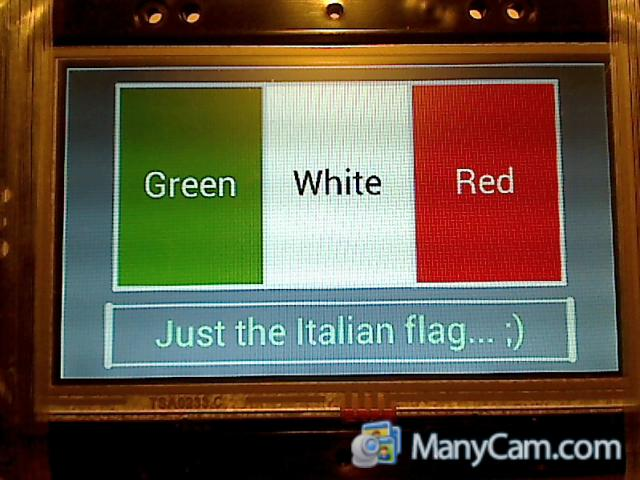
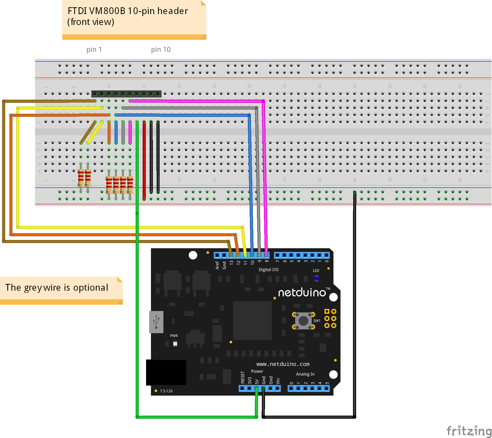

**Project Description**
WPF-like library for simple graphic-UI application using Netduino (Plus) 2 and the FTDI FT800 Eve board.

# At a glance...
Ever wanted to add a TFT/touch display to your Netduino application?
Now it's very easy: take your Netduino Plus 2 (or Netduino 2) and wire a [FTDI FT800 Eve board](http://www.ftdichip.com/EVE.htm), then begin your journey to this new immersive adventure!
This library allows to create a graphic user-interface in minutes, with a minimal impact to your main project. Don't shoot at your feet by programming at low-level, rather think at higher!
The programming approach is declarative: if you know the "original" WPF (or Silverlight, or Windows Phone), you'll be two steps ahead. However, the few resources available in a Netduino imposed several compromises, but WPF still are the "muse" able to inspire this project.

# Documentation
Check the tutorial [here](http://1drv.ms/1k6smVF).
Introductory (legacy) article [here](http://highfieldtales.wordpress.com/2014/02/16/netduino-ft800-eve-microwpf/)

# How to wire the FTDI Eve to the Netduino
All the resistors are 2.2k Ohms.
Please, refer to the FTDI VM800B datasheet [here](http://www.ftdichip.com/Support/Documents/DataSheets/Modules/DS_VM800B.pdf)

# Implementation status
|| Component || Status || Remarks || Resources ||
| Window | **OK** | | [video](https://www.youtube.com/watch?v=fx44O86nniM) |
| Page | **OK** | | [video](https://www.youtube.com/watch?v=q-xtgLEH71A) |
| CalibrationWindow | **OK** | Should persist on NVRAM | |
| StackPanel | **OK** | | |
| Grid | Partial | Missing "Auto"; DesiredSize yields incorrect value | |
| TextBlock | **OK** | | |
| PushButton | **OK** | | [video](https://www.youtube.com/watch?v=LlZ2M5uau1U) |
| ToggleButton | Partial | Control size behaves weird | [video](https://www.youtube.com/watch?v=AKudPAyC6eM) |
| Slider | **OK** | | [video](https://www.youtube.com/watch?v=Iizs4TFMu0c) |
| DialKnob | **OK** | | [video](https://www.youtube.com/watch?v=em785QyE3gg) |
| ProgressBar | _to-do_ | | |
| Spinner | _to-do_ | | |
| WallClock | _to-do_ | | |
| Image | _to-do_ | | |
| TextBox | _to-do_ | | |

# Useful links
[http://www.ftdichip.com/EVE.htm](http://www.ftdichip.com/EVE.htm)
[http://www.netduino.com/](http://www.netduino.com/)
[http://highfieldtales.wordpress.com/](http://highfieldtales.wordpress.com/)
[http://cet-electronics.com/](http://cet-electronics.com/)

---